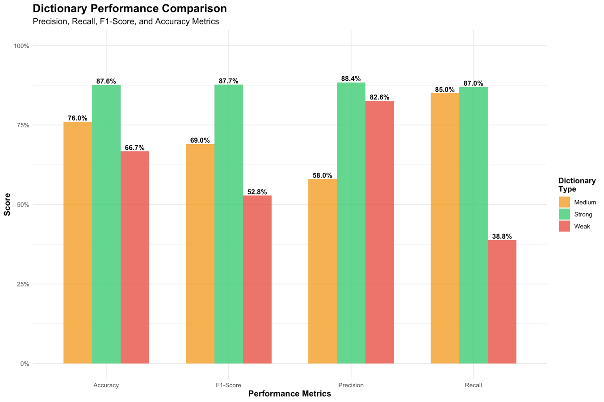
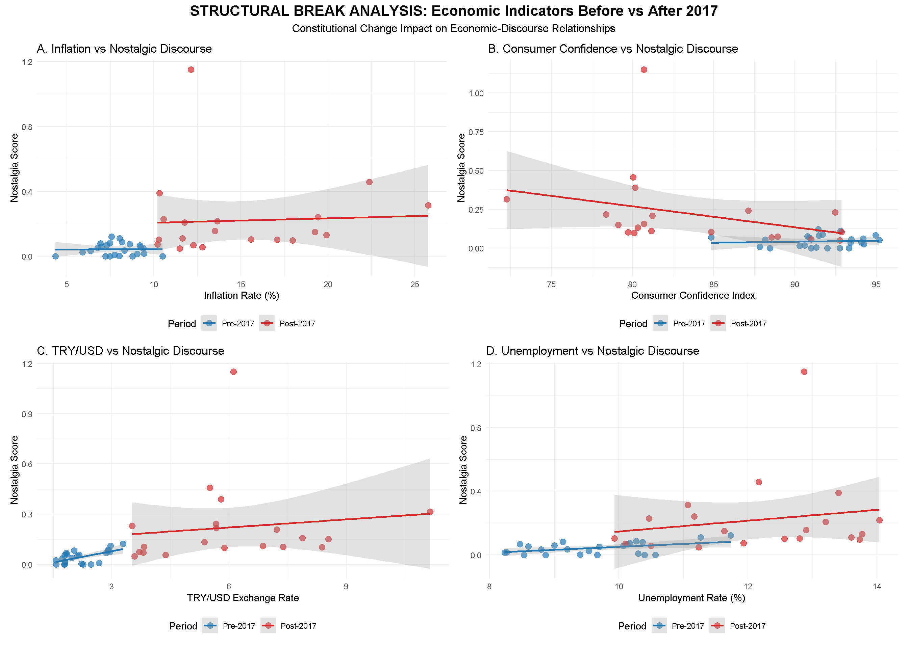
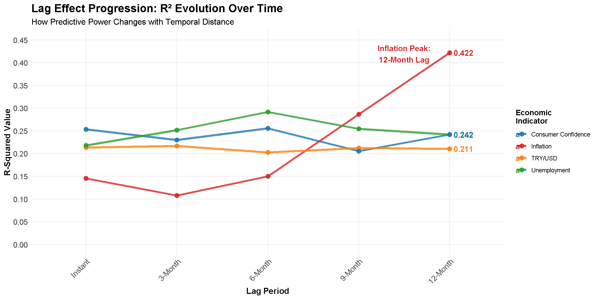

# Escape Ramps: Crisis, Nostalgia, and Parliamentary Rhetoric
### A Computational Analysis of Turkish Political Discourse (2011–2022)

> **MSc Thesis** · Politics and Data Science · University College Dublin · 2.1 Honours  
> Sadullah Alp Dikmen

---

## Overview

This project investigates whether Turkey's Justice and Development Party (AKP) strategically increases nostalgic rhetoric in parliamentary speeches during periods of economic hardship — and whether that response is *delayed*, suggesting deliberate political strategy rather than spontaneous emotional reaction.

Using **29,860 AKP parliamentary speeches** from the Turkish Grand National Assembly (2011–2022), the study applies computational text analysis to detect nostalgic discourse and correlate it with macroeconomic indicators including inflation, unemployment, and currency depreciation.

**Key finding:** Nostalgic discourse peaks 6–12 months *after* economic shocks — consistent with nostalgia functioning as a deliberate "concealment mechanism" to redirect public attention from policy failures.

---

## Research Questions

1. Does the AKP's nostalgic rhetoric increase during economic downturns?
2. Did a structural shift in nostalgic discourse occur following Turkey's 2017 constitutional referendum?

Both hypotheses were confirmed empirically.

---

## Methods & Technical Stack

| Component | Tools / Approach |
|---|---|
| **Data source** | ParlaMint-TR corpus (CLARIN ERIC) — standardised XML parliamentary data |
| **Language preprocessing** | Zemberek NLP (Turkish lemmatisation, 94.3% success rate) |
| **Text analysis** | R + Quanteda (document-feature matrix, dictionary-based scoring) |
| **Nostalgia detection** | Custom-built nostalgia dictionary (iterative refinement: 283 → 76 → 26 collocations) |
| **Validation** | 500 sentences manually coded by the author (stratified: 250 nostalgic / 250 non-nostalgic) — **87.6% accuracy, F1: 87.7%** |
| **Statistical models** | Correlation analysis, lag regression (0–4 quarters), structural break testing, VIF diagnostics |
| **Economic data** | TÜİK (inflation, unemployment) + CBRT (CPI, exchange rate, consumer confidence) |

---

## Key Results

### Dictionary Performance
| Dictionary | Accuracy | Precision | Recall | F1 |
|---|---|---|---|---|
| Strong (26 collocations) | **87.6%** | **88.4%** | **87.0%** | **87.7%** |
| Medium (76 collocations) | 72.1% | 71.3% | 72.9% | 69.0% |
| Weak (283 collocations) | 72.9% | 55.7% | 85.0% | 52.8% |

> Validation: 500 sentences manually coded by the author for the Strong dictionary (stratified sampling, 250 nostalgic / 250 non-nostalgic). Results presented incrementally per 100 sentences — confirming metric stability (plateau effect).

### Economic Indicators vs. Nostalgic Discourse
- **Inflation** (lag 4, ~12 months): β = 0.032, p < 0.001, R² = 42.2%
- **Unemployment** (lag 2–4): significant across multiple periods
- **Consumer Confidence Index**: r = –0.50 (stronger negative correlation post-2017)
- **TRY/USD Exchange Rate**: r = 0.46, optimal lag at 3 months

### 2017 Structural Break
- Post-2017 dummy: β = 6.838, **p = 0.015**
- R² increased from 27.1% → 41.2% after including the 2017 breakpoint
- Consumer confidence interaction post-2017: β = –0.061, p = 0.018

---

## Visualisations

### Nostalgic Discourse Evolution (2011–2022)

*Quarterly AKP nostalgic discourse scores across three dictionary specifications. Dashed line marks the 2017 constitutional referendum.*

### Temporal Lag Effects — R² Heatmap

*R² values for each economic indicator across lag periods (0–12 months). Inflation at 12-month lag achieves the highest explanatory power (R²=0.422).*

### Economic Indicators Correlation Matrix

*Pairwise correlations between economic indicators and nostalgia score. Consumer confidence shows the strongest inverse relationship (r=–0.50).*

### Dictionary Precision-Recall Trade-off

*Strong dictionary dominates across both precision and F1-score, justifying the final selection of 26 high-confidence collocations.*

### Dictionary Performance Comparison

*Bar chart comparing Accuracy, F1-Score, Precision, and Recall across all three dictionary versions. Strong dictionary leads on every metric.*

### Structural Break Analysis — Before vs After 2017

*Scatter plots showing the relationship between each economic indicator and nostalgic discourse, split by pre- and post-2017 constitutional change. The divergence in slopes confirms the structural shift hypothesis.*

### Lag Effect Progression — R² Evolution Over Time

*R² values for each economic indicator as lag period increases from instant to 12 months. Inflation's predictive power surges uniquely at 12 months (R²=0.422), the clearest evidence for the concealment mechanism.*

---

## Repository Structure

```
├── notebooks/
│   ├── 01_data_cleaning.R         # Word count filtering (286K → 29,860 speeches)
│   ├── 02_stopword_filtering.R    # Procedural keyword removal
│   ├── 03_lemmatisation.py        # Turkish lemmatisation via Zemberek NLP
│   ├── 04_ngram_dictionary.R      # N-gram collocation extraction & dictionary construction
│   ├── 05_nostalgia_scoring.R     # Nostalgia score calculation (Müller & Proksch 2024)
│   ├── 06_validation.R            # Stratified validation sample generation
│   └── 07_regression_analysis.R  # Regression, lag models, VIF, structural break
├── outputs/
│   └── figures/                   # All charts and visualisations
└── README.md
```

---

## Reproducing the Analysis

### Prerequisites

```r
# R packages
install.packages(c("quanteda", "quanteda.textstats", "quanteda.textplots",
                   "ggplot2", "dplyr", "stringr", "lubridate",
                   "readxl", "writexl", "corrplot", "broom",
                   "stargazer", "car", "lmtest"))
```

```bash
# Python (for Zemberek lemmatisation)
pip install jpype1 pandas
# Download Zemberek JAR: https://github.com/ahmetaa/zemberek-nlp/releases
# Java JDK 21 required
```

### Run Order

```bash
# 1. Filter and clean raw corpus
Rscript notebooks/01_data_cleaning.R

# 2. Remove procedural keywords
Rscript notebooks/02_stopword_filtering.R

# 3. Lemmatise with Zemberek NLP
python notebooks/03_lemmatisation.py

# 4. Extract n-gram collocations and build dictionary
Rscript notebooks/04_ngram_dictionary.R

# 5. Calculate nostalgia scores
Rscript notebooks/05_nostalgia_scoring.R

# 6. Generate validation samples
Rscript notebooks/06_validation.R

# 7. Run regression and lag analysis
Rscript notebooks/07_regression_analysis.R
```

---

## AI-Assisted Workflow

This project incorporated **Claude (Anthropic)** and **ChatGPT (OpenAI)** as research and development tools:

- **Code debugging:** R and Python script troubleshooting throughout the analysis pipeline
- **Conceptual framing:** Supporting disambiguation of nostalgia from nationalist and Islamist rhetoric during dictionary development
- **Research writing:** Structuring analytical arguments and reviewing methodological framing
- **This repository:** README and documentation prepared with Claude

> Note: All validation coding (500 sentences) was conducted entirely by the author. AI tools were not used for annotation due to concerns about political bias and the risk of conflating nostalgia with related rhetorical phenomena.

---

## Data Sources

- **Parliamentary speeches:** [ParlaMint 5.0](https://www.clarin.si/repository/xmlui/handle/11356/2004) — Erjavec et al. (2025)
- **Inflation / Unemployment:** [TÜİK](https://www.tuik.gov.tr)
- **Exchange rates / Consumer Confidence:** [CBRT EVDS](https://evds2.tcmb.gov.tr)

---

## Citation

```bibtex
@mastersthesis{dikmen2025escape,
  author  = {Sadullah Alp Dikmen},
  title   = {Escape Ramps: Crisis, Nostalgia, and Parliamentary Rhetoric —
             A Computational Analysis of Turkish Political Discourse},
  school  = {University College Dublin},
  year    = {2025},
  month   = {August}
}
```

---

## Contact

**Alp Dikmen**  
[LinkedIn](https://www.linkedin.com/in/alp-dikmen-428b54156/) · alpdikmen007@gmail.com  
Dublin, Ireland

---

*Built with R · Quanteda · Zemberek NLP · Python*
